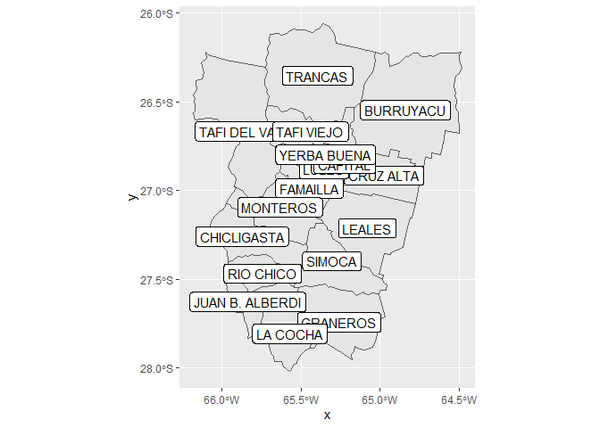
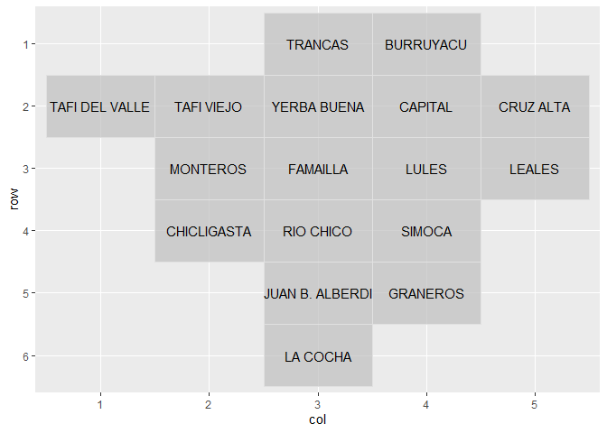

## `geo`grafía `Ar`rgentina usando `R` <a></a>

<!-- README.md is generated from README.Rmd. Please edit that file -->
<!-- badges: start -->

[](https://lifecycle.r-lib.org/articles/stages.html#experimental)
[](https://CRAN.R-project.org/package=opinAr)
[](https://github.com/PoliticaArgentina/opinAr/actions)

<!-- badges: end -->

`{geoAr}` brinda herramientas que facilitan el acceso y el trabajo con
datos espaciales de Argentina desde `R`.

------------------------------------------------------------------------

### INSTALACIÓN

### Versión en desarrollo (*Development version*)

``` r
# install.packages('devtools') si no tiene instalado devtools

devtools::install_github("politicaargentina/geoAr")
```

### Ejemplo de uso (*Usage*)

``` r
library(geoAr)


show_arg_codes() # Preview avialable data 
#> # A tibble: 26 x 5
#>    id           codprov codprov_censo codprov_iso name_iso                      
#>    <chr>        <chr>   <chr>         <chr>       <chr>                         
#>  1 ARGENTINA    " "     " "           AR          Argentina                     
#>  2 CABA         "01"    "02"          AR-C        Ciudad Autónoma de Buenos Air~
#>  3 BUENOS AIRES "02"    "06"          AR-B        Buenos Aires                  
#>  4 CATAMARCA    "03"    "10"          AR-K        Catamarca                     
#>  5 CORDOBA      "04"    "14"          AR-X        Córdoba                       
#>  6 CORRIENTES   "05"    "18"          AR-W        Corrientes                    
#>  7 CHACO        "06"    "22"          AR-H        Chaco                         
#>  8 CHUBUT       "07"    "26"          AR-U        Chubut                        
#>  9 ENTRE RIOS   "08"    "30"          AR-E        Entre Ríos                    
#> 10 FORMOSA      "09"    "34"          AR-P        Formosa                       
#> # ... with 16 more rows


(tucuman <- get_geo(geo = "TUCUMAN")) # geo id parameter
#> Simple feature collection with 17 features and 2 fields
#> Geometry type: MULTIPOLYGON
#> Dimension:     XY
#> Bounding box:  xmin: -66.18101 ymin: -28.01575 xmax: -64.48315 ymax: -26.06037
#> Geodetic CRS:  WGS 84
#> # A tibble: 17 x 3
#>    codprov_censo coddepto_censo                                         geometry
#>  * <chr>         <chr>                                        <MULTIPOLYGON [°]>
#>  1 90            007            (((-64.49919 -26.23353, -64.49857 -26.26325, -6~
#>  2 90            014            (((-65.13782 -26.74975, -65.10095 -26.75771, -6~
#>  3 90            021            (((-65.94729 -27.08444, -65.93885 -27.0989, -65~
#>  4 90            028            (((-65.62733 -26.87134, -65.62598 -26.84177, -6~
#>  5 90            035            (((-65.47532 -27.53838, -65.43503 -27.5425, -65~
#>  6 90            042            (((-65.51768 -27.54528, -65.53685 -27.62278, -6~
#>  7 90            049            (((-65.51348 -27.62978, -65.52091 -27.66553, -6~
#>  8 90            056            (((-65.12933 -27.02488, -65.12589 -27.01659, -6~
#>  9 90            063            (((-65.43583 -26.83751, -65.38124 -26.84196, -6~
#> 10 90            070            (((-65.86853 -26.99852, -65.85796 -27.01388, -6~
#> 11 90            077            (((-65.93481 -27.39544, -65.89887 -27.3702, -65~
#> 12 90            084            (((-65.16293 -26.82289, -65.18562 -26.86204, -6~
#> 13 90            091            (((-65.33499 -27.20478, -65.33462 -27.21948, -6~
#> 14 90            098            (((-66.08361 -26.23547, -66.06621 -26.23792, -6~
#> 15 90            105            (((-65.70111 -26.52317, -65.65078 -26.5263, -65~
#> 16 90            112            (((-65.52483 -26.09667, -65.4682 -26.09253, -65~
#> 17 90            119            (((-65.27025 -26.84087, -65.28587 -26.83549, -6~


(tucuman_names <- tucuman %>%
  add_geo_codes()) # Augment data with metadata as districts names or alternative id codes
#> Simple feature collection with 17 features and 8 fields
#> Geometry type: MULTIPOLYGON
#> Dimension:     XY
#> Bounding box:  xmin: -66.18101 ymin: -28.01575 xmax: -64.48315 ymax: -26.06037
#> Geodetic CRS:  WGS 84
#> # A tibble: 17 x 9
#>    codprov_censo coddepto_censo codprov coddepto nomdepto_censo  name_prov
#>    <chr>         <chr>          <chr>   <chr>    <chr>           <chr>    
#>  1 90            007            23      013      BURRUYACU       TUCUMAN  
#>  2 90            014            23      012      CRUZ ALTA       TUCUMAN  
#>  3 90            021            23      005      CHICLIGASTA     TUCUMAN  
#>  4 90            028            23      003      FAMAILLA        TUCUMAN  
#>  5 90            035            23      009      GRANEROS        TUCUMAN  
#>  6 90            042            23      007      JUAN B. ALBERDI TUCUMAN  
#>  7 90            049            23      008      LA COCHA        TUCUMAN  
#>  8 90            056            23      011      LEALES          TUCUMAN  
#>  9 90            063            23      002      LULES           TUCUMAN  
#> 10 90            070            23      004      MONTEROS        TUCUMAN  
#> 11 90            077            23      006      RIO CHICO       TUCUMAN  
#> 12 90            084            23      001      CAPITAL         TUCUMAN  
#> 13 90            091            23      010      SIMOCA          TUCUMAN  
#> 14 90            098            23      017      TAFI DEL VALLE  TUCUMAN  
#> 15 90            105            23      016      TAFI VIEJO      TUCUMAN  
#> 16 90            112            23      014      TRANCAS         TUCUMAN  
#> 17 90            119            23      015      YERBA BUENA     TUCUMAN  
#> # ... with 3 more variables: codprov_iso <chr>, name_iso <chr>,
#> #   geometry <MULTIPOLYGON [°]>


# MAPING

ggplot2::ggplot(data = tucuman_names) +
  ggplot2::geom_sf() +
  ggplot2::geom_sf_label(ggplot2::aes(label = nomdepto_censo))
#> Warning in st_point_on_surface.sfc(sf::st_zm(x)): st_point_on_surface may not
#> give correct results for longitude/latitude data
```



``` r

# GRIDS AS IF THEY WHERE MAPS FOR {geofacet}

(grid_tucuman <- get_grid("TUCUMAN"))
#>    name_provincia row col code            name
#> 1         TUCUMAN   1   4  013       BURRUYACU
#> 2         TUCUMAN   2   4  001         CAPITAL
#> 3         TUCUMAN   4   2  005     CHICLIGASTA
#> 4         TUCUMAN   2   5  012       CRUZ ALTA
#> 5         TUCUMAN   3   3  003        FAMAILLA
#> 6         TUCUMAN   5   4  009        GRANEROS
#> 7         TUCUMAN   5   3  007 JUAN B. ALBERDI
#> 8         TUCUMAN   6   3  008        LA COCHA
#> 9         TUCUMAN   3   5  011          LEALES
#> 10        TUCUMAN   3   4  002           LULES
#> 11        TUCUMAN   3   2  004        MONTEROS
#> 12        TUCUMAN   4   3  006       RIO CHICO
#> 13        TUCUMAN   4   4  010          SIMOCA
#> 14        TUCUMAN   2   1  017  TAFI DEL VALLE
#> 15        TUCUMAN   2   2  016      TAFI VIEJO
#> 16        TUCUMAN   1   3  014         TRANCAS
#> 17        TUCUMAN   2   3  015     YERBA BUENA

geofacet::grid_preview(grid_tucuman, label = "name")
#> Note: You provided a user-specified grid. If this is a generally-useful
#>   grid, please consider submitting it to become a part of the geofacet
#>   package. You can do this easily by calling:
#>   grid_submit(__grid_df_name__)
```



## `{geoAr}` es parte del universo de paquetes **polAr**


