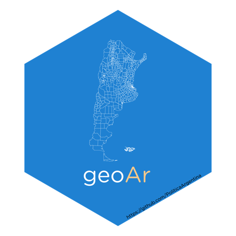

## `geo`grafía `Ar`rgentina usando `R` <a></a>

<!-- README.md is generated from README.Rmd. Please edit that file -->
<!-- badges: start -->

[](https://lifecycle.r-lib.org/articles/stages.html#experimental)
[](https://CRAN.R-project.org/package=geoAr)
[](https://github.com/PoliticaArgentina/geoAr/actions)

<!-- badges: end -->

`{geoAr}` brinda herramientas que facilitan el acceso y el trabajo con
datos espaciales de Argentina desde `R`.

------------------------------------------------------------------------

### INSTALACIÓN

### Versión en desarrollo (*Development version*)

``` r
# install.packages('devtools') si no tiene instalado devtools

devtools::install_github("politicaargentina/geoAr")
```

### Desde `CRAN` o `r-universe` (version en desarrollo)

``` r
# Install geoAr in R:
install.packages('geoAr', repos = c('https://politicaargentina.r-universe.dev', 'https://cloud.r-project.org'))
```

### Ejemplo de uso básico (*Basic Usage*)

``` r
library(geoAr)


show_arg_codes() # Preview avialable data 
#> # A tibble: 26 x 5
#>    id           codprov codprov_censo codprov_iso name_iso                      
#>    <chr>        <chr>   <chr>         <chr>       <chr>                         
#>  1 ARGENTINA    " "     " "           AR          Argentina                     
#>  2 CABA         "01"    "02"          AR-C        Ciudad Autónoma de Buenos Air~
#>  3 BUENOS AIRES "02"    "06"          AR-B        Buenos Aires                  
#>  4 CATAMARCA    "03"    "10"          AR-K        Catamarca                     
#>  5 CORDOBA      "04"    "14"          AR-X        Córdoba                       
#>  6 CORRIENTES   "05"    "18"          AR-W        Corrientes                    
#>  7 CHACO        "06"    "22"          AR-H        Chaco                         
#>  8 CHUBUT       "07"    "26"          AR-U        Chubut                        
#>  9 ENTRE RIOS   "08"    "30"          AR-E        Entre Ríos                    
#> 10 FORMOSA      "09"    "34"          AR-P        Formosa                       
#> # ... with 16 more rows


(tucuman <- get_geo(geo = "TUCUMAN")) # geo id parameter from show_arg_codes() function
#> Simple feature collection with 17 features and 2 fields
#> Geometry type: MULTIPOLYGON
#> Dimension:     XY
#> Bounding box:  xmin: -66.18101 ymin: -28.01575 xmax: -64.48315 ymax: -26.06037
#> Geodetic CRS:  WGS 84
#> # A tibble: 17 x 3
#>    codprov_censo coddepto_censo                                         geometry
#>  * <chr>         <chr>                                        <MULTIPOLYGON [°]>
#>  1 90            007            (((-64.49919 -26.23353, -64.49857 -26.26325, -6~
#>  2 90            014            (((-65.13782 -26.74975, -65.10095 -26.75771, -6~
#>  3 90            021            (((-65.94729 -27.08444, -65.93885 -27.0989, -65~
#>  4 90            028            (((-65.62733 -26.87134, -65.62598 -26.84177, -6~
#>  5 90            035            (((-65.47532 -27.53838, -65.43503 -27.5425, -65~
#>  6 90            042            (((-65.51768 -27.54528, -65.53685 -27.62278, -6~
#>  7 90            049            (((-65.51348 -27.62978, -65.52091 -27.66553, -6~
#>  8 90            056            (((-65.12933 -27.02488, -65.12589 -27.01659, -6~
#>  9 90            063            (((-65.43583 -26.83751, -65.38124 -26.84196, -6~
#> 10 90            070            (((-65.86853 -26.99852, -65.85796 -27.01388, -6~
#> 11 90            077            (((-65.93481 -27.39544, -65.89887 -27.3702, -65~
#> 12 90            084            (((-65.16293 -26.82289, -65.18562 -26.86204, -6~
#> 13 90            091            (((-65.33499 -27.20478, -65.33462 -27.21948, -6~
#> 14 90            098            (((-66.08361 -26.23547, -66.06621 -26.23792, -6~
#> 15 90            105            (((-65.70111 -26.52317, -65.65078 -26.5263, -65~
#> 16 90            112            (((-65.52483 -26.09667, -65.4682 -26.09253, -65~
#> 17 90            119            (((-65.27025 -26.84087, -65.28587 -26.83549, -6~
```

## Información Disponible (*Available Data*)

### GEOMETRÍAS

**Poligonos**

-   ARGENTINA (niveles PROVINCIA, DEPARTAMENTO y RADIO CENSAL)

-   24 provincias (niveles DEPARTAMENTO y RADIO CENSAL)

-   Reconstrucción de los poligonos utilizados para los censos desde
    1869 hasta 2010. Recuperado del proyecto *Base cartográfica de
    departamentos para los censos nacionales de la República Argentina
    desde 1869 a 2010* de [Gonzalo Rodriguez y Pablo De
    Grande](https://ri.conicet.gov.ar/handle/11336/149867).

-   Geometrías (entidades, envolventes y radios) correspondientes a la
    Encuesta Permanenete de Hogares (EPH) de INDEC.

**PUNTOS**

-   Base de Asentamientos Humanos de la República Argentina (BAHRA)
    <http://www.bahra.gob.ar/>

### GRILLAS

-   Grillas para usar con
    [geofacet](https://politicaargentina.github.io/geoAr/articles/geoAr_geofacet.html)
    para ARGENTINA, 24 provincias y AGLOMERADOS URBANOS (para usar con
    {eph}

-   Libro de códigos (país, provincia, departamento) y función para
    recodificar grillas según diccionario (ISO, INDEC, INDRA).

## Paquetes similares para otros países (*Similar packages*)

-   `{geoUy}` - <https://github.com/RichDeto/geouy>
-   `{geoBr}` - <https://ipeagit.github.io/geobr/>
-   `{chilemapas}` - <https://pacha.dev/chilemapas/>

## Citation

To cite package ‘geoAr’ in publications use:

Juan Pablo Ruiz Nicolini (2023). geoAr: Argentina’s Spatial Data
Toolbox. R package version 0.0.1.4.
<https://github.com/PoliticaArgentina/geoAr>

A BibTeX entry for LaTeX users is

      @Manual{,
        title = {geoAr: Argentina's Spatial Data Toolbox},
        author = {Juan Pablo {Ruiz Nicolini}},
        year = {2023},
        note = {R package version 0.0.1.4.2},
        url = {https://github.com/PoliticaArgentina/geoAr},
      }

## `{geoAr}` es parte del [universo de paquetes **polAr**](https://github.com/PoliticaArgentina/polArverse)


