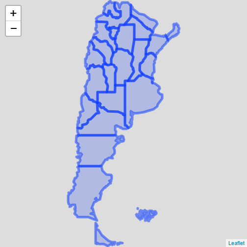

```r
library(geoAr) # Argentina's Spatial Data Toolbox, [github::PoliticaArgentina/geoAr] v0.0.1.2
library(geofacet) # 'ggplot2' Faceting Utilities for Geographical Data, CRAN v0.2.0
```

`{geoAr}` está pensado para facilitar el acceso a datos y el trabajo con información geográfica de argentina. Una de las posibilidades es la descarga de capas ge geometrías con el objetivo de visualizar información. Una alternativa típica es utilizar `{sf}` para trabajar con datos de este tipo y combinarlo con `{ggplot2}` (y su función `geom_sf()` para visualizar capas geográficas.)


```r

tucuman <- get_geo(geo = "TUCUMAN")

(tucuman_names <- tucuman %>%
  add_geo_codes()) # Augment data with metadata as districts names or alternative id codes
#> Simple feature collection with 17 features and 8 fields
#> Geometry type: MULTIPOLYGON
#> Dimension:     XY
#> Bounding box:  xmin: -66.18101 ymin: -28.01575 xmax: -64.48315 ymax: -26.06037
#> Geodetic CRS:  WGS 84
#> # A tibble: 17 x 9
#>    codprov_censo coddepto_censo codprov coddepto nomdepto_censo  name_prov codprov_iso
#>    <chr>         <chr>          <chr>   <chr>    <chr>           <chr>     <chr>      
#>  1 90            007            23      013      BURRUYACU       TUCUMAN   AR-T       
#>  2 90            014            23      012      CRUZ ALTA       TUCUMAN   AR-T       
#>  3 90            021            23      005      CHICLIGASTA     TUCUMAN   AR-T       
#>  4 90            028            23      003      FAMAILLA        TUCUMAN   AR-T       
#>  5 90            035            23      009      GRANEROS        TUCUMAN   AR-T       
#>  6 90            042            23      007      JUAN B. ALBERDI TUCUMAN   AR-T       
#>  7 90            049            23      008      LA COCHA        TUCUMAN   AR-T       
#>  8 90            056            23      011      LEALES          TUCUMAN   AR-T       
#>  9 90            063            23      002      LULES           TUCUMAN   AR-T       
#> 10 90            070            23      004      MONTEROS        TUCUMAN   AR-T       
#> 11 90            077            23      006      RIO CHICO       TUCUMAN   AR-T       
#> 12 90            084            23      001      CAPITAL         TUCUMAN   AR-T       
#> 13 90            091            23      010      SIMOCA          TUCUMAN   AR-T       
#> 14 90            098            23      017      TAFI DEL VALLE  TUCUMAN   AR-T       
#> 15 90            105            23      016      TAFI VIEJO      TUCUMAN   AR-T       
#> 16 90            112            23      014      TRANCAS         TUCUMAN   AR-T       
#> 17 90            119            23      015      YERBA BUENA     TUCUMAN   AR-T       
#> # i 2 more variables: name_iso <chr>, geometry <MULTIPOLYGON [°]>


# MAPING

ggplot2::ggplot(data = tucuman_names) +
  ggplot2::geom_sf() +
  ggplot2::geom_sf_label(ggplot2::aes(label = nomdepto_censo))
#> Warning in st_point_on_surface.sfc(sf::st_zm(x)): st_point_on_surface may not give correct
#> results for longitude/latitude data
```



No obstante, existen ocaciones en las que la visualización de información geográfica a través de mapas convencionales puede no ser la mejor opción. `{geofacet}` es un paquete que busca sacar provecho de la potencia de `{ggplot2}` y utilizar el _facetado_ de un modo que cada caja de una grilla represente una entidad y que la suma de estas guarden relación con su distribución espacial.  


### Ejemplo 

En los gráficos que siguen se representa un indicador tipico de la Ciencia Política (el _Número Efectivo de Partidos_) para una serie de tiempo para todas las provincias de Argentina. En el primer caso esto está facilitado al generar un _facet_ a partir de la variable PROVINCIA, generando un pequeño gráfico para cada distrito (_small multiple_).   


En el segundo se utiliza geofacet para acomodar esta grilla _cómo si fuera un mapa_ de Argentina. Facilitando de este modo una mirada que tenga en cuenta (y conocimiento) de la distribución geográfica de las provincias. 


>“El paquete geofacet amplía ggplot2 de una manera que facilita la creación de visualizaciones geográficamente facetadas en R. Para usar geofacet se toman datos que representan diferentes entidades geográficas y se aplica un método de visualización para cada entidad. El conjunto resultante de visualizaciones conforma una cuadrícula que imita la topología geográfica original”.

(Traducción propia de la nota intorudctoria del autor, Ryan Haffen. Fuente: https://tuqmano.ar/posts/Geofacetear.html)

Los siguientes puntos resumen las ventajas potenciales para el uso de esta herramientas en comparación de otras técnicas para representar información a través de mapas u otras alterantivas (como cartogramas, tilemaps, etc.):

* se pueden graficar múltiples variables para cada unidad geográfica

* se pueden aplicar otros esquemas de codificación visual más allá del color

* cada unidad geográfica tiene asignada la misma proporción espacial


Una particularidad del paquete `{geofacet}` es que propicia el desarrollo de grillas por parte de usuaries. Tanto para uso _ad hoc_ como para contribuir con un [repositorio de grillas que alimenta el paquete](https://hafen.github.io/geofacet/articles/geofacet.html#list-available-grids). Esta iniciativa nos impulsó a desarrollar grillas para Argentina y todas sus provincias, que terminaron conformando  `{geofacetAR}`, antecedente de este proyecto que tuvo sus primeros pasos en el marco del _1° LatinR_ en el que presentamos *Geofaceting Argentina*

[Abstract](https://github.com/TuQmano/geofacet_ARG/blob/master/.LatinR/Geofaceting_Argentina_RuizNicolini.pdf) | 📊 [Slides](https://www.researchgate.net/publication/327382101_Geofaceting_Argentina_LatinR_2018) | 📦 [{geofaceteAR}](https://electorarg.github.io/geofaceteAR/) | ⌨️ [blogpost](https://tuqmano.ar/posts/2020-05-22-empaquetar.html).


### get_grid()

Así como `get_geo()` permite descargar un set de datos que incluyen una variable `geometry` con información geográfica para la generación de mapas, `get_grid()` permite descargar grillas pre diseñadas para Argentina y cada una de las provincias. 


```r

(tucuman_names <- tucuman %>%
  add_geo_codes()) # Augment data with metadata as districts names or alternative id codes
#> Simple feature collection with 17 features and 8 fields
#> Geometry type: MULTIPOLYGON
#> Dimension:     XY
#> Bounding box:  xmin: -66.18101 ymin: -28.01575 xmax: -64.48315 ymax: -26.06037
#> Geodetic CRS:  WGS 84
#> # A tibble: 17 x 9
#>    codprov_censo coddepto_censo codprov coddepto nomdepto_censo  name_prov codprov_iso
#>    <chr>         <chr>          <chr>   <chr>    <chr>           <chr>     <chr>      
#>  1 90            007            23      013      BURRUYACU       TUCUMAN   AR-T       
#>  2 90            014            23      012      CRUZ ALTA       TUCUMAN   AR-T       
#>  3 90            021            23      005      CHICLIGASTA     TUCUMAN   AR-T       
#>  4 90            028            23      003      FAMAILLA        TUCUMAN   AR-T       
#>  5 90            035            23      009      GRANEROS        TUCUMAN   AR-T       
#>  6 90            042            23      007      JUAN B. ALBERDI TUCUMAN   AR-T       
#>  7 90            049            23      008      LA COCHA        TUCUMAN   AR-T       
#>  8 90            056            23      011      LEALES          TUCUMAN   AR-T       
#>  9 90            063            23      002      LULES           TUCUMAN   AR-T       
#> 10 90            070            23      004      MONTEROS        TUCUMAN   AR-T       
#> 11 90            077            23      006      RIO CHICO       TUCUMAN   AR-T       
#> 12 90            084            23      001      CAPITAL         TUCUMAN   AR-T       
#> 13 90            091            23      010      SIMOCA          TUCUMAN   AR-T       
#> 14 90            098            23      017      TAFI DEL VALLE  TUCUMAN   AR-T       
#> 15 90            105            23      016      TAFI VIEJO      TUCUMAN   AR-T       
#> 16 90            112            23      014      TRANCAS         TUCUMAN   AR-T       
#> 17 90            119            23      015      YERBA BUENA     TUCUMAN   AR-T       
#> # i 2 more variables: name_iso <chr>, geometry <MULTIPOLYGON [°]>


# GRIDS AS IF THEY WHERE MAPS FOR {geofacet}

(grid_tucuman <- get_grid("TUCUMAN"))
#> Adding missing grouping variables: `name_provincia`
#>    name_provincia            name row col code
#> 1         TUCUMAN       BURRUYACU   1   4  013
#> 2         TUCUMAN         CAPITAL   2   4  001
#> 3         TUCUMAN     CHICLIGASTA   4   2  005
#> 4         TUCUMAN       CRUZ ALTA   2   5  012
#> 5         TUCUMAN        FAMAILLA   3   3  003
#> 6         TUCUMAN        GRANEROS   5   4  009
#> 7         TUCUMAN JUAN B. ALBERDI   5   3  007
#> 8         TUCUMAN        LA COCHA   6   3  008
#> 9         TUCUMAN          LEALES   3   5  011
#> 10        TUCUMAN           LULES   3   4  002
#> 11        TUCUMAN        MONTEROS   3   2  004
#> 12        TUCUMAN       RIO CHICO   4   3  006
#> 13        TUCUMAN          SIMOCA   4   4  010
#> 14        TUCUMAN  TAFI DEL VALLE   2   1  017
#> 15        TUCUMAN      TAFI VIEJO   2   2  016
#> 16        TUCUMAN         TRANCAS   1   3  014
#> 17        TUCUMAN     YERBA BUENA   2   3  015

geofacet::grid_preview(grid_tucuman, label = "name")
#> Note: You provided a user-specified grid. If this is a generally-useful grid,
#>   please consider submitting it to become a part of the geofacet package. You
#>   can do this easily by calling: grid_submit(__grid_df_name__)
```


