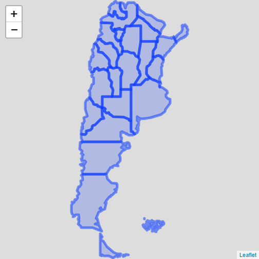
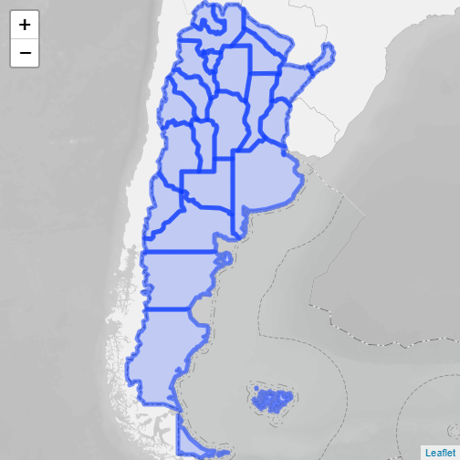

```r
library(geoAr) # Argentina's Spatial Data Toolbox, [github::PoliticaArgentina/geoAr] v0.0.1.2
library(leaflet) # Create Interactive Web Maps with the JavaScript 'Leaflet' Library, CRAN v2.0.4.1
```


`{geoAr}` facilita la descarga de polígonos para distintos niveles de agregación o división política de Argentina. Por ejemplo se puede descargar un mapa de todo el país al nivel de radios censales, departamentos o provincial. En el siguiente ejemplo se descargar un mapa nacional al nivel provincial y se utiliza sintaxis de `leaflet` para `R` para generar una visualización rápida interactiva.


```r

argentina <- get_geo(geo = "ARGENTINA", level = "provincia")

leaflet(argentina) %>%
  addPolygons()
#> PhantomJS not found. You can install it with webshot::install_phantomjs(). If it is installed, please make sure the phantomjs executable can be found via the PATH variable.
```



`leaflet` permite con una simple liena agregarle una capa base de una veriedad de proveedores distintos que permiten mayor contexto geográfico a la capa que se está representando. En el ejemplo siguiente se utiliza una capa de _Open Street Map_.


```r
leaflet(argentina) %>%
  addPolygons() %>%
  addProviderTiles(provider = providers$OpenStreetMap)
```


`{goAr}` también incluye una función relativa a este punto. La misma se basa en la función anterior para permitir el agregado de una capa base desarrollada por el [Instituto Geográfico Nacional](https://www.ign.gob.ar/NuestrasActividades/InformacionGeoespacial/ServiciosOGC/Leaflet).


```r
leaflet(argentina) %>%
  addPolygons() %>%
  geoAr::addArgTiles()
```




